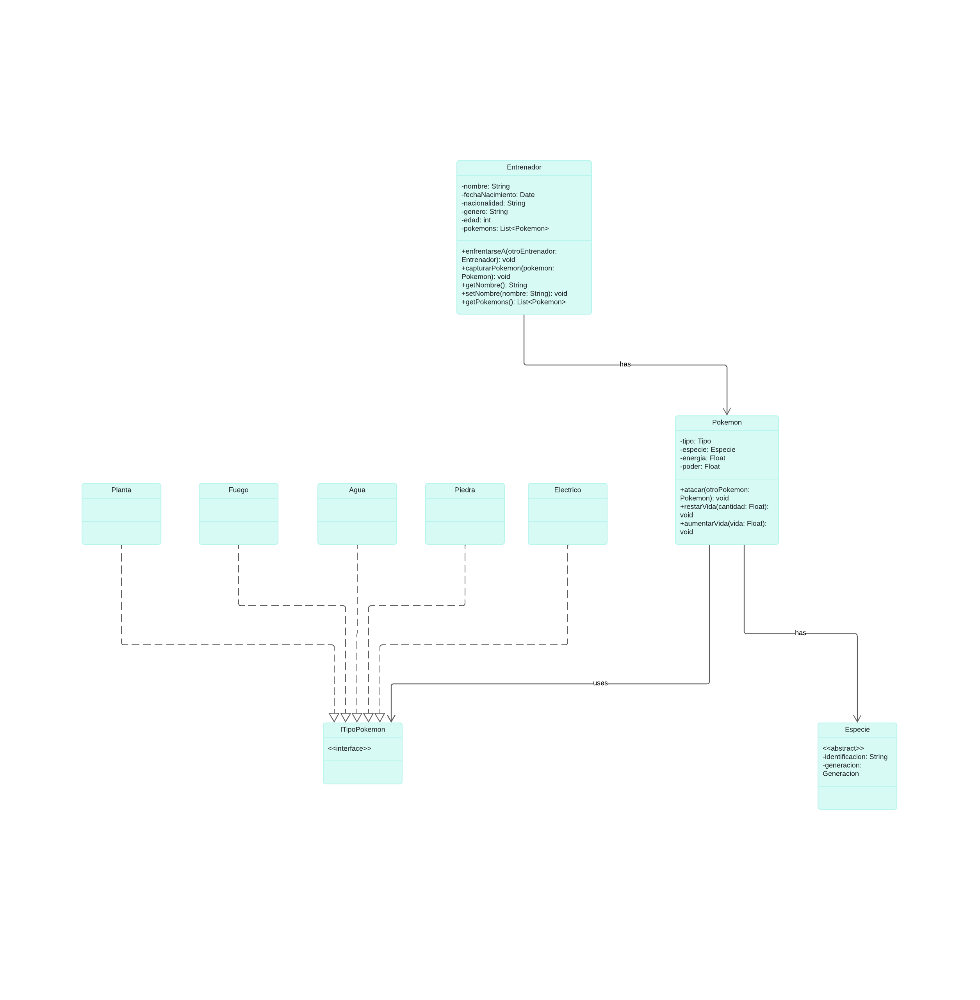

# Hito 1

## Consigna
Se desea modelar dos clases: **Entrenador** y **Pokemon**.

De un **Entrenador** sabemos su nombre, fecha de nacimiento, nacionalidad, género, edad y los Pokémons que tiene, con un máximo de 5.

Un **Entrenador** entiende:
- `enfrentarseA(Entrenador otroEntrenador)`: método para iniciar una batalla con otro entrenador.
- `capturarPokemon(Pokemon pokemon)`: método para capturar un nuevo Pokémon (máximo 5).
- Métodos `getters` y `setters` para cada atributo.

De un **Pokemon** sabemos:
- `tipo`: Eléctrico, Agua, Fuego, Planta, Piedra.
- `especie`, `energía`, y `poder`: números que van entre 0 y 100.

Un **Pokemon** entiende:
- `atacar(Pokemon otroPokemon)`: método para atacar a otro Pokémon.
- `restarVida(Float cant)`: método para reducir la vida.
- `aumentarVida(Float vida)`: método para incrementar la vida.

Además del modelo, se pide implementar el **DAO** (Data Access Object) para cada entidad, incluyendo las operaciones de **CRUD** (Create, Read, Update, Delete) de cada una.

## Descripción del Modelo

### Clases a Modelar
1. **Entrenador**
    - **Atributos**:
        - `nombre`: String
        - `fechaNacimiento`: Date
        - `nacionalidad`: String
        - `genero`: String
        - `edad`: int
        - `pokemons`: List<Pokemon> (máximo 5 pokémons)

    - **Métodos**:
        - `enfrentarseA(Entrenador otroEntrenador)`: Iniciar una batalla con otro entrenador.
        - `capturarPokemon(Pokemon pokemon)`: Capturar un nuevo Pokémon, limitado a 5.
        - Getters y Setters para cada atributo.

2. **Pokemon**
    - **Atributos**:
        - `tipo`: Tipo (interfaz)
        - `especie`: Especie (clase abstracta)
        - `energia`: Float (valor entre 0 y 100)
        - `poder`: Float (valor entre 0 y 100)

    - **Métodos**:
        - `atacar(Pokemon otroPokemon)`: Atacar a otro Pokémon.
        - `restarVida(Float cant)`: Reducir la vida.
        - `aumentarVida(Float vida)`: Incrementar la vida.

### Clase Abstracta y Interfaces
- **Tipo**: Interfaz que representa el tipo del Pokémon. Cada tipo específico (Eléctrico, Agua, Fuego, Planta, Piedra) implementará esta interfaz.
- **Especie**: Clase abstracta que contiene los atributos:
    - `identificacion`: String
    - `generacion`: Enum (representa la generación del Pokémon).

### Requisitos DAO
Implementar el **DAO** para cada entidad, incluyendo las operaciones de **CRUD** (Create, Read, Update, Delete).

## Diagrama de Clases

### Diagrama
