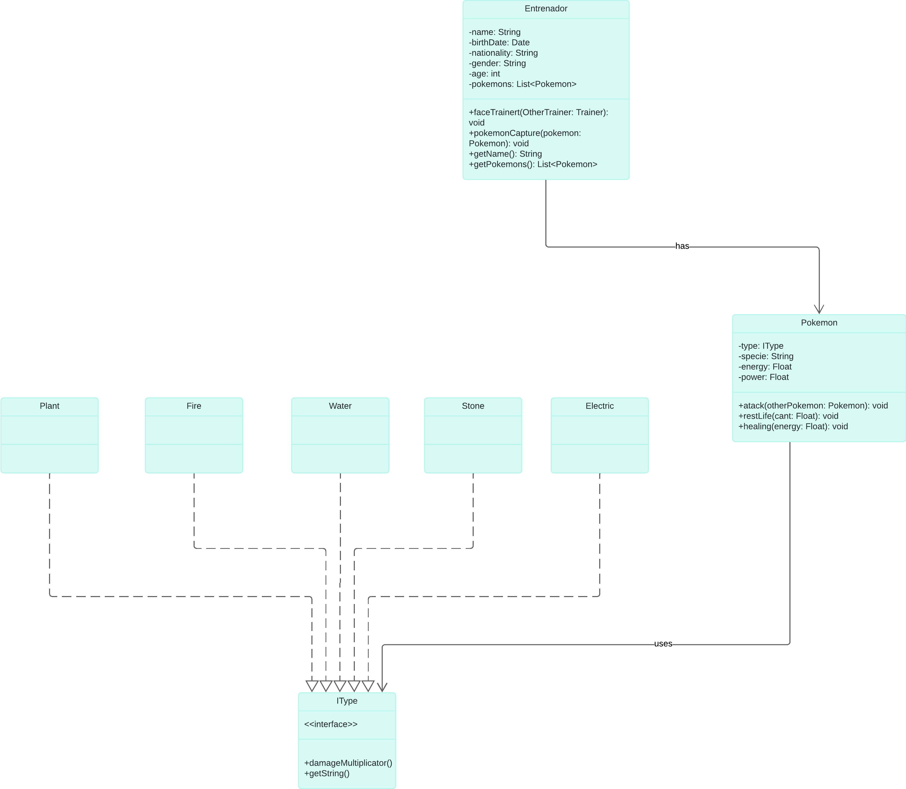

# Proyecto Pokémon Trainer

## Navegación
- [Hito 1](#hito-1)
   - [Consigna](#consigna)
- [Hito 2](#hito-2)
   - [Consigna](#consigna-1)
- [Descripción del Modelo](#descripción-del-modelo)
- [Diagrama de Clases](#diagrama-de-clases)
- [Tareas Pendientes](#tareas-pendientes)

# Hito 1

## Consigna
Se desea modelar dos clases: **Entrenador** y **Pokemon**.

De un **Entrenador** sabemos su nombre, fecha de nacimiento, nacionalidad, género, edad y los Pokémons que tiene, con un máximo de 5.

Un **Entrenador** entiende:
- `enfrentarseA(Entrenador otroEntrenador)`: método para iniciar una batalla con otro entrenador.
- `capturarPokemon(Pokemon pokemon)`: método para capturar un nuevo Pokémon (máximo 5).
- Métodos `getters` y `setters` para cada atributo.

De un **Pokemon** sabemos:
- `tipo`: Eléctrico, Agua, Fuego, Planta, Piedra.
- `especie`, `energía`, y `poder`: números que van entre 0 y 100.

Un **Pokemon** entiende:
- `atacar(Pokemon otroPokemon)`: método para atacar a otro Pokémon.
- `restarVida(Float cant)`: método para reducir la vida.
- `aumentarVida(Float vida)`: método para incrementar la vida.

Además del modelo, se pide implementar el **DAO** (Data Access Object) para cada entidad, incluyendo las operaciones de **CRUD** (Create, Read, Update, Delete) de cada una.

# Hito 2

## Consigna
Se pide extender el dominio del hito uno. Cada Pokémon tiene un poder vinculado, que tiene un costo de poder y produce un determinado daño. Además, la cantidad de daño va a depender del tipo:

- Si un tipo eléctrico ataca a uno de tipo agua, le produce un 50% más de daño, pero se hace a sí mismo un 5% de daño.
- Si un tipo agua ataca a un tipo fuego, le hace un 25% de daño extra.
- Si un tipo fuego ataca a un Pokémon de tipo planta, le hace un 20% de daño extra.
- Si un tipo planta ataca a un tipo piedra, no le produce daño.

Además, se debe implementar la funcionalidad para que un Entrenador pueda capturar un Pokémon (siempre y cuando no tenga más de 5 Pokémons capturados). Un Pokémon será capturado cuando llegue a 0 puntos de vida.

## Descripción del Modelo

### Clases a Modelar

1. **Trainer (Entrenador)**
   - **Atributos**:
      - `name` (nombre): String
      - `birthDate` (fecha de nacimiento): LocalDate
      - `nationality` (nacionalidad): String
      - `gender` (género): String
      - `age` (edad): int
      - `pokemonList` (lista de Pokémons): List<Pokemon> (máximo de 5 Pokémons)

   - **Métodos**:
      - `faceTrainer(Trainer otherTrainer)` (enfrentarse a otro entrenador): Inicia una batalla con otro entrenador.
      - `capturePokemon(Pokemon pokemon)` (capturar Pokémon): Captura un nuevo Pokémon, limitado a 5.
      - Getters y setters para cada atributo.
      - `getName()`: Devuelve el nombre del entrenador.
      - `setName(String name)`: Establece el nombre del entrenador.
      - `getPokemons()`: Devuelve la lista de Pokémons.

2. **Pokemon**
   - **Atributos**:
      - `type` (tipo): IType (interfaz)
      - `species` (especie): String
      - `energy` (energía): Float (valor entre 0 y 100)
      - `power` (poder): int (valor entre 0 y 100)
      - `id`: int

   - **Métodos**:
      - `attack(Pokemon otherPokemon)` (atacar a otro Pokémon): Ataca a otro Pokémon, reduciendo su energía.
      - `reduceEnergy(float amount)` (reducir vida): Disminuye la energía del Pokémon en una cantidad específica.
      - `increaseEnergy(float amount)` (aumentar vida): Incrementa la energía del Pokémon en una cantidad específica.
      - Getters y setters para `type`, `species`, `energy`, `power` e `id`.

### Interfaces

- **IType (Tipo)**: Interfaz que representa el tipo del Pokémon. Cada tipo específico (Eléctrico, Agua, Fuego, Planta, Roca) implementa esta interfaz e incluye:
   - `damageMultiplicator()`: Define la lógica del multiplicador de daño.
   - `getTypeName()`: Devuelve el nombre del tipo.

## Diagrama de Clases

### Diagrama

## Tareas Pendientes

- [x] Terminar la implementación de la clase Trainer
- [x] Actualizar la variable `species` a String en la clase Pokemon
- [ ] Escribir pruebas unitarias para el método `faceTrainer`
- [ ] Escribir pruebas unitarias para los métodos de Pokemon